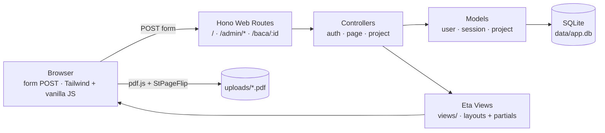

# Dider

> Dider (Digital Reader) — platform baca dokumen & majalah digital ala
> [pubhtml5.com](https://pubhtml5.com/): **upload PDF**, baca dengan pengalaman
> **flipbook**.


---

## Latar Belakang

Menyajikan majalah/dokumen digital biasanya butuh platform berbayar. Dider
memberikan cara sederhana: **upload PDF** dari area admin, lalu pembaca
membukanya dengan pengalaman **flipbook** (efek membalik halaman) seperti
majalah sungguhan — langsung dari browser.

## Arsitektur

Server-rendered MVC (gaya Laravel): Hono controller mengembalikan **view Eta**
(HTML), semua submit via **form POST** + redirect (PRG). Tidak ada JSON API
terpisah. PDF disimpan di `uploads/` dan dibaca via **pdf.js** + **StPageFlip**.



**Keamanan terpasang:** cookie session `httpOnly` + `sameSite=Lax`, password
di-hash argon2 (`Bun.password`), `hono/csrf` (origin) di semua request,
escape default Eta (`<%=`), validasi upload (hanya PDF, maks 50MB).

---

## Struktur Repository (MVC)

```
dider/
├── src/
│   ├── index.ts                # entry: server Bun (port 3000, hot reload)
│   ├── app.ts                  # build Hono app + middleware + static (/uploads, /vendor)
│   ├── db.ts                   # koneksi DB (sqlite | supabase) + migrasi
│   ├── view.ts                 # setup Eta + helper view()/redirect()/flash
│   ├── models/                 # MODEL — akses data / query SQL
│   │   ├── user.model.ts       #   users: register, verifyPassword (argon2)
│   │   ├── session.model.ts    #   sessions: create/find/delete session cookie
│   │   └── project.model.ts    #   projects (dokumen PDF): create, list, findById, delete
│   ├── controllers/            # CONTROLLER — form POST → model → view/redirect
│   │   ├── auth.controller.ts  #   /admin/login, /admin/register, /admin/logout
│   │   ├── page.controller.ts  #   GET / (homepage), GET /baca/:id (reader)
│   │   └── project.controller.ts # /admin/dokumen* — upload PDF, list, hapus
│   ├── middleware/
│   │   ├── auth.middleware.ts  # session helpers + requireAuth + guest
│   │   └── locals.middleware.ts # inject user login + flash ke context
│   └── routes/
│       └── web.ts              # router web: pasang controller + injectLocals
├── views/                      # VIEW — template Eta (Blade/EJS-like)
│   ├── layouts/                #   layout admin & homepage
│   ├── partials/               #   navbar + error list
│   ├── admin/                  #   tampilan admin (auth + dokumen)
│   └── homepage/               #   tampilan depan user (index + baca)
├── public/                     # aset statis (style.css Tailwind, page-flip.css)
├── uploads/                    # file PDF hasil upload (di-gitignore)
├── supabase/migrations/        # skema SQL versi Supabase (opsional)
├── test/                       # unit test (`bun test`, SQLite in-memory)
└── .github/                    # template issue/PR + CI
```

---

## Quickstart

```bash
bun install
bun run dev        # terminal 1: server di http://localhost:3000 (hot reload)
bun run dev:css    # terminal 2: compile Tailwind (watch)
```

Build CSS produksi: `bun run build:css` — hasilnya `public/style.css`.

---

## Rute

| Method | Path | View / Aksi | Auth |
|--------|------|-------------|------|
| GET | `/` | `homepage/index` — daftar dokumen | - |
| GET | `/health` | health check | - |
| GET | `/baca/:id` | `homepage/baca` — reader flipbook | - |
| GET | `/admin/login` | `admin/auth/login` | guest |
| POST | `/admin/login` | login → `/admin/dokumen` | guest |
| GET | `/admin/register` | `admin/auth/register` | guest |
| POST | `/admin/register` | buat user → `/admin/dokumen` | guest |
| POST | `/admin/logout` | logout → `/` | ✓ |
| GET | `/admin/dokumen` | `admin/dokumen/index` — list + form upload | ✓ |
| POST | `/admin/dokumen` | upload PDF (multipart) | ✓ |
| POST | `/admin/dokumen/:id/delete` | hapus dokumen + file | ✓ |

Semua mutasi via form POST (PRG). Upload divalidasi: hanya `application/pdf`
(atau ekstensi `.pdf`), maksimal **50MB**, disimpan sebagai
`uploads/<uuid>.pdf`.

---

## Testing

```bash
bun test
```

Unit test pakai `bun test` (folder `test/`). DB test memakai SQLite **in-memory** —
tidak menyentuh `data/app.db`. Cakupan saat ini:

| File | Menguji |
|---|---|
| `test/session.model.test.ts` | create/find/delete session |
| `test/user.model.test.ts` | register, verifyPassword, tanpa bocor hash |
| `test/project.model.test.ts` | CRUD dokumen (nama + pdf_path) |
| `test/web.test.ts` | render view, auth flow, upload PDF (valid/invalid), reader, hapus, flash |

CI otomatis menjalankan `bun test` + `bun run build:css` di setiap push/PR ke
`master`.

---

## Ganti ke Supabase

1. `bun add @supabase/supabase-js`
2. Apply `supabase/migrations/001_init.sql` di Supabase (SQL Editor / `supabase db push`)
3. Copy `.env.example` → `.env`, set:
   ```
   DB_DRIVER=supabase
   SUPABASE_URL=...
   SUPABASE_ANON_KEY=...
   ```

Catatan: route saat ini **sqlite-first**. Saat pindah Supabase, tambahkan branch
`db.supabase` di tiap controller (pola `if (db.sqlite) { ... } else { ... }`).

---

## Roadmap

- **Sampul & thumbnail** — tampilkan preview halaman pertama di daftar dokumen.
- **Mode layar penuh** — pengalaman baca imersif ala pubhtml5.
- **Supabase driver** — implementasikan branch `db.supabase` di controller.

Lihat [issue-issue](https://github.com/ccit-venture/dider/issues) untuk daftar
pekerjaan yang sedang/akan dikerjakan.

---

## Kontribusi

Project ini **open source** — kontribusi sangat terbuka! Cara paling cepat:

1. **Fork** repository
2. Buat branch fitur: `git checkout -b feat/nama-fitur`
3. Jalankan test: `bun test`
4. Buat **Pull Request** dengan mengisi template yang sudah disediakan

Panduan lengkap (fork, sinkron upstream, gaya commit) →
[CONTRIBUTING.md](CONTRIBUTING.md). Sebelum mengubah kode, baca juga
[AGENTS.md](AGENTS.md) untuk konvensi struktur & hal yang sering salah.

Komunitas berpegang pada [Kode Etik](CODE_OF_CONDUCT.md). Untuk masalah
keamanan, jangan buka issue publik — lihat [SECURITY.md](SECURITY.md).

---

## Kontributor

| Nama | Peran |
|------|-------|
| Muhammad Hudya Ramadhana | Maintainer, backend & API |

**Institusi:** CEP CCIT-FTUI

---

## Lisensi

MIT License — bebas digunakan dengan menyertakan atribusi.

---

<p align="center">
  <sub>Dider · Venture Studio CCIT-FTUI</sub>
</p>