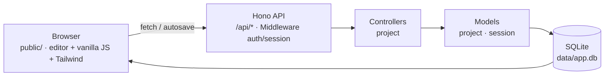

# Dider

> Dider (Digital Reader) — aplikasi web pembuat dokumen & majalah digital yang
> diekspor ke PDF. Terinspirasi dari [pubhtml5.com](https://pubhtml5.com/).


---

## Latar Belakang

Membuat dokumen atau majalah digital biasanya butuh aplikasi desktop yang berat.
Dider hadir sebagai editor berbasis web yang ringan: susun **halaman** dari
**blok-blok** konten, atur **ukuran halaman**, simpan (autosave), dan export ke
**PDF** siap cetak — semuanya dari browser.

## Arsitektur

Alur: View (frontend statis) → fetch ke API (Hono) → Controller → Model → SQLite.



**Keamanan terpasang:** cookie session `httpOnly` + `sameSite=Lax`, password
di-hash argon2 (`Bun.password`), `hono/csrf` + `secureHeaders` + `cors`.

---

## Struktur Repository (MVC)

```
dider/
├── src/
│   ├── index.ts                # entry: server Bun (port 3000, hot reload)
│   ├── app.ts                  # build Hono app + middleware global + static
│   ├── db.ts                   # koneksi DB (sqlite | supabase) + migrasi
│   ├── models/                 # MODEL — akses data / query SQL
│   │   ├── project.model.ts    #   projects: create, list, findById, update
│   │   └── session.model.ts    #   sessions: create/find/delete session cookie
│   ├── controllers/            # CONTROLLER — parse request → model → response
│   │   └── project.controller.ts # /api/projects: CRUD dokumen/majalah
│   ├── middleware/
│   │   └── auth.middleware.ts  # session cookie helpers + requireAuth
│   ├── routes/
│   │   └── index.ts            # router: pasang controller ke /api/*
│   └── styles/input.css        # sumber Tailwind (compile → public/style.css)
├── public/                     # VIEW — HTML statis + vanilla JS + CSS hasil
│   ├── index.html              #   landing
│   ├── app.js                  #   fetch ke API
│   └── style.css               #   hasil compile Tailwind (jangan diedit manual)
├── supabase/migrations/        # skema SQL versi Supabase (opsional)
├── test/                       # unit test (`bun test`, SQLite in-memory)
└── .github/                    # template issue/PR + CI
```

---

## Quickstart

```bash
bun install
bun run dev        # terminal 1: server di http://localhost:3000 (hot reload)
bun run dev:css    # terminal 2: compile Tailwind (watch)
```

Build CSS produksi: `bun run build:css` — hasilnya `public/style.css`.

---

## API

| Method | Endpoint | Deskripsi | Auth |
|--------|----------|-----------|------|
| GET | `/api/ping` | Health check API | - |
| POST | `/api/projects` | Simpan proyek `{nama, ukuran, halaman}` | ✓ |
| GET | `/api/projects` | Daftar proyek ringkas | - |
| GET | `/api/projects/:id` | Ambil satu proyek lengkap (buka editor) | - |
| PUT | `/api/projects/:id` | Update/autosave proyek | ✓ |

Health check: `GET /health` → status driver DB.

---

## Testing

```bash
bun test
```

Unit test pakai `bun test` (folder `test/`). DB test memakai SQLite **in-memory** —
tidak menyentuh `data/app.db`. Cakupan saat ini:

| File | Menguji |
|---|---|
| `test/session.model.test.ts` | create/find/delete session |
| `test/project.model.test.ts` | CRUD proyek, JSON parse halaman/ukuran |
| `test/api.test.ts` | integrasi API: ping, 401 tanpa login, 404 id tidak ada |

CI otomatis menjalankan `bun test` + `bun run build:css` di setiap push/PR ke
`master`.

---

## Ganti ke Supabase

1. `bun add @supabase/supabase-js`
2. Apply `supabase/migrations/001_init.sql` di Supabase (SQL Editor / `supabase db push`)
3. Copy `.env.example` → `.env`, set:
   ```
   DB_DRIVER=supabase
   SUPABASE_URL=...
   SUPABASE_ANON_KEY=...
   ```

Catatan: route saat ini **sqlite-first**. Saat pindah Supabase, tambahkan branch
`db.supabase` di tiap route (pola `if (db.sqlite) { ... } else { ... }`).

---

## Roadmap

- **Auth lengkap** — halaman login/register (saat ini `requireAuth` ada tapi
  belum ada endpoint/auth untuk membuat session).
- **Editor visual** — UI editor dengan blok konten & preview halaman.
- **Export PDF** — generate PDF dari proyek.
- **Supabase driver** — implementasikan branch `db.supabase` di controller.

Lihat [issue-issue](https://github.com/ccit-venture/dider/issues) untuk daftar
pekerjaan yang sedang/akan dikerjakan.

---

## Kontribusi

Project ini **open source** — kontribusi sangat terbuka! Cara paling cepat:

1. **Fork** repository
2. Buat branch fitur: `git checkout -b feat/nama-fitur`
3. Jalankan test: `bun test`
4. Buat **Pull Request** dengan mengisi template yang sudah disediakan

Panduan lengkap (fork, sinkron upstream, gaya commit) →
[CONTRIBUTING.md](CONTRIBUTING.md). Sebelum mengubah kode, baca juga
[AGENTS.md](AGENTS.md) untuk konvensi struktur & hal yang sering salah.

Komunitas berpegang pada [Kode Etik](CODE_OF_CONDUCT.md). Untuk masalah
keamanan, jangan buka issue publik — lihat [SECURITY.md](SECURITY.md).

---

## Kontributor

| Nama | Peran |
|------|-------|
| Muhammad Hudya Ramadhana | Maintainer, backend & API |

**Institusi:** CEP CCIT-FTUI

---

## Lisensi

MIT License — bebas digunakan dengan menyertakan atribusi.

---

<p align="center">
  <sub>Dider · Venture Studio CCIT-FTUI</sub>
</p>
